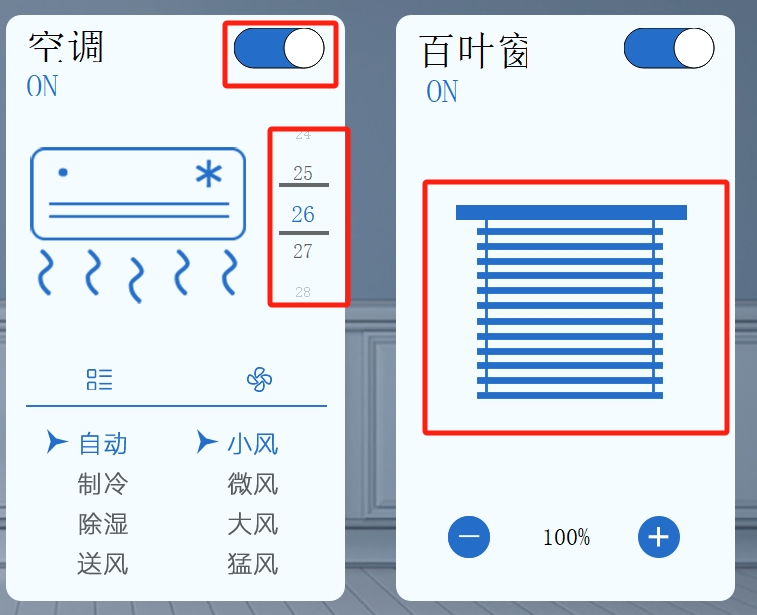

# 目录

- [效果展示](#效果展示-1)
- [产品简述](#产品简述-2)
- [组件简介](#组件简介-3)
    - [滑动按钮](#滑动按钮-1)
    - [滚动数轴](#滚动数轴-2)
    - [百叶窗](#百叶窗-3)

---
# 效果展示 

<video width="1000" height="800" controls>
  <source src="home.mp4" type="video/mp4">
</video>

# 产品简述 

一个管理家里各电器的控制页面，数据有变动时会通过底层封好的远程接口将数据发到服务器

# 组件简介 

## 滑动按钮 

继承widget，重写paintEvent，先画矩形，在矩形上画白色的圆。  
点击时用QTimer启动定时刷新，通过开关状态移动圆形的中心位置。

## 滚动数轴 

继承widget，重写paintEvent，鼠标事件。绘制不同位置数字、格栏。  
鼠标上下移动时，根据鼠标按下时y坐标和上下的移动的距离进行paint绘制，达到数字滚动效果。  
释放鼠标，利用动画。将数据居中。

## 百叶窗 

使用一个widget作为窗体，一个label放置窗帘背景图片。
移动时改变label的y坐标，坐标为负数的时label超出窗体部分不显示，