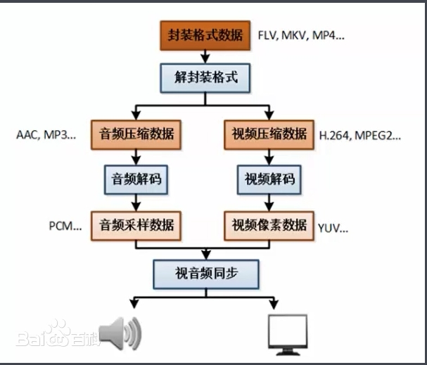

# 目录

- [效果展示](#效果展示-1)
- [产品概述](#产品概述-2)
- [功能简述](#功能简述-3)
    - [音频](#音频-1)
    - [视频](#视频-2)
    - [定位播放](#定位播放-3)

---
# 效果展示 

<video width="800" height="600" controls>
  <source src="player.mp4" type="video/mp4">
</video>

# 产品概述 

界面采用 qt widget 开发。ffmpeg、sdl2 处理音视频。

# 功能简述 

打开文件，读取流媒体数据，解封装后分别放入音视频处理队列。以音频的时钟为基线播放视频和音频。在解码音频文件时使用ffmpeg的滤镜功能实现倍数播放原理。

## 音频 

通过SDL库注册声卡用的数据回调函数，每次声卡进行回调时，进行解码、滤镜，然后处理好的数据给到声卡播放。  
声卡回调时进行音频解码。

## 视频 

利用qt的painter事件，用解码上来的图片进行渲染。  
视频解码在一个单独线程进行，每帧视频解码后对比时间戳是否能根音频同步，是则将图片抛给上层展示，否则丢弃这帧数据。

## 定位播放 
1.清空解码任务队列
2.以视频的关键帧将解封装器定位到此
3.恢复正常解码播放流程  