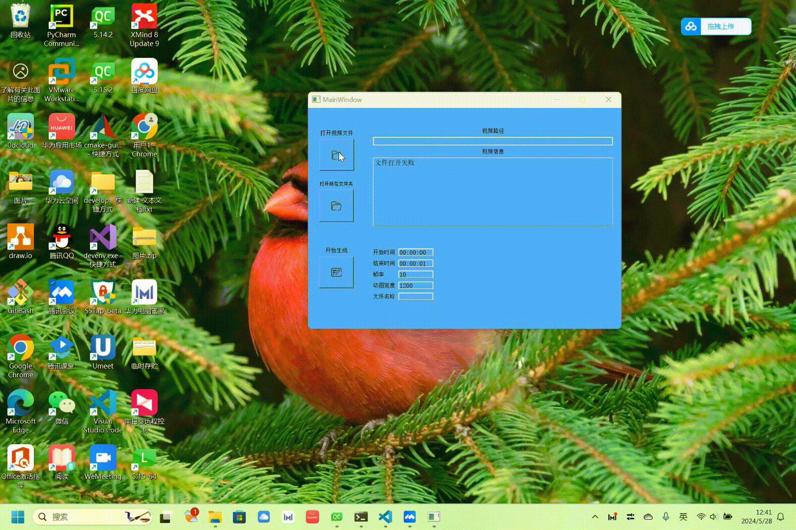

# 目录

- [产品概述](#产品概述-1)
    - [功能简介](#功能简介-1)
- [部分效果展示](#部分效果展示-2)
    - [选择视频文件](#选择视频文件-2)
    - [生成gif效果](#生成gif效果-3)

---
# 产品概述 
win64上的一款qt写的软件，利用ffmpeg将视频文件转化成gif动图。
## 功能简介 
1.选择取视频数据流信息预览（视频的宽、高、帧率等）  
2.自定义视频截取时间  
3.帧率可调节  
4.比例缩放（根据宽度设定的值按比例缩放）  

# 部分效果展示 

## 选择视频文件 

## 生成gif效果 

