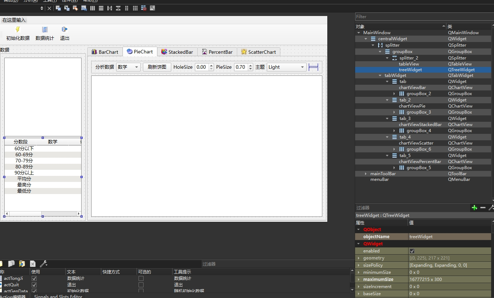
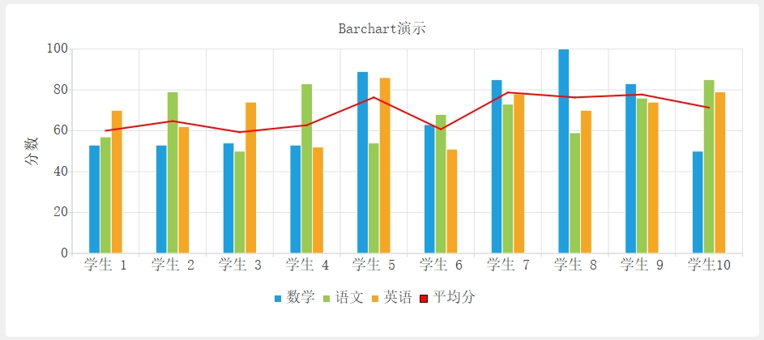
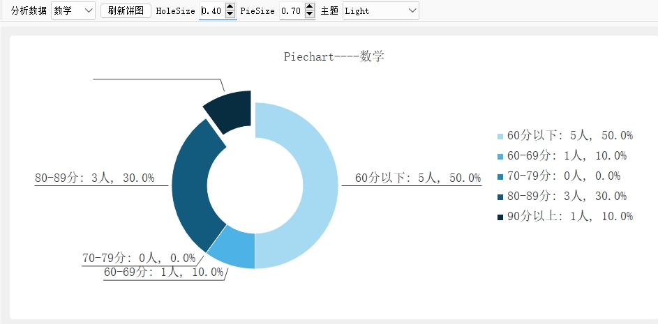
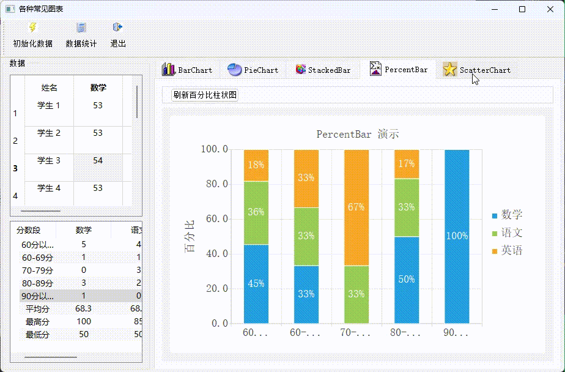

# 目录

- [效果展示](#效果展示-1)
- [功能浅析](#功能浅析-2)
    - [ui设计](#ui设计-1)
    - [柱状图](#柱状图-2)
    - [饼状图](#饼状图-3)
    - [叠加柱](#叠加柱-4)
    - [百分比柱](#百分比柱-5)
    - [散点图](#散点图-6)

---
# 效果展示 <a id="效果展示-1"></a>

<video width="800" height="530" controls>
  <source src="all_chart.mp4" type="video/mp4">
</video>

# 功能浅析 <a id="功能浅析-2"></a>

## ui设计 <a id="ui设计-1"></a>



## 柱状图 <a id="柱状图-2"></a>



```cpp
void MainWindow::iniBarChart()
{
    //柱状图初始化
    QChart *chart = new QChart(); //创建chart
    chart->setTitle("Barchart演示");
    chart->setAnimationOptions(QChart::SeriesAnimations);
    ui->chartViewBar->setChart(chart); //为ChartView设置chart
    ui->chartViewBar->setRenderHint(QPainter::Antialiasing); // 抗锯齿
}
void MainWindow::buildBarChart()
{
    // 构造柱状图
    QChart *chart =ui->chartViewBar->chart(); //获取ChartView关联的chart
    chart->removeAllSeries(); //删除所有序列

    // 移除坐标轴
    removeAllAxis(chart);   //

    // 创建三个QBarSet数据集,从数据模型的表头获取Name
    QBarSet *setMath = new QBarSet(theModel->horizontalHeaderItem(colNoMath)->text());
    QBarSet *setChinese = new QBarSet(theModel->horizontalHeaderItem(colNoChinese)->text());
    QBarSet *setEnglish= new QBarSet(theModel->horizontalHeaderItem(colNoEnglish)->text());

    // 创建一个QLineSeries序列用于显示平均分
    QLineSeries *Line = new QLineSeries();
    Line->setName(theModel->horizontalHeaderItem(colNoAverage)->text());
    QPen    pen;
    pen.setColor(Qt::red);
    pen.setWidth(2);
    Line->setPen(pen);

    for(int i=0;i<theModel->rowCount();i++)
    {
        // 从数据模型获取数据
        setMath->append(theModel->item(i,colNoMath)->text().toInt()); //数学
        setChinese->append(theModel->item(i,colNoChinese)->text().toInt()); //语文
        setEnglish->append(theModel->item(i,colNoEnglish)->text().toInt()); //英语
        Line->append(QPointF(i,theModel->item(i,colNoAverage)->text().toFloat()));  //平均分
    }

    // 创建一个柱状图序列 QBarSeries, 并添加三个数据集
    QBarSeries *series = new QBarSeries();
    series->append(setMath);
    series->append(setChinese);
    series->append(setEnglish);

    chart->addSeries(series); // 添加柱状图序列
    chart->addSeries(Line); // 添加折线图序列

    //用于横坐标在字符串列表,即学生姓名
    QStringList categories;
    for (int i=0;i<theModel->rowCount();i++)
        categories <<theModel->item(i,colNoName)->text();

    //用于柱状图的 x坐标轴
    QBarCategoryAxis *axisX = new QBarCategoryAxis();
    axisX->append(categories); //添加横坐标文字列表
    axisX->setRange(categories.at(0), categories.at(categories.count()-1)); //这只坐标轴范围
    chart->addAxis(axisX, Qt::AlignBottom);  

    //数值型坐标作为 y坐标轴
    QValueAxis *axisY = new QValueAxis;
    axisY->setRange(0, 100);
    axisY->setTitleText("分数");
    axisY->setTickCount(6); // 6 个主分隔
    axisY->setLabelFormat("%.0f"); //标签格式
    chart->addAxis(axisY, Qt::AlignLeft);

    // 柱状图
    series->attachAxis(axisX);
    series->attachAxis(axisY);

    // 折线图
    Line->attachAxis(axisX);
    Line->attachAxis(axisY);

    // 图标下方，语文、数学、英语、平均分颜色标识
    chart->legend()->setVisible(true); // 显示图例
    chart->legend()->setAlignment(Qt::AlignBottom); // 图例显示在下方
}
```

## 饼状图 <a id="饼状图-3"></a>



```cpp
void MainWindow::iniPiewChart()
{
    //饼图初始化
    QChart *chart = new QChart();
    chart->setTitle(" Piechart演示");
    chart->setAnimationOptions(QChart::SeriesAnimations);
    ui->chartViewPie->setChart(chart);
    ui->chartViewPie->setRenderHint(QPainter::Antialiasing); // 抗锯齿
}
void MainWindow::buildPieChart()
{
    //绘制饼图
    QChart *chart =ui->chartViewPie->chart(); //获取chart对象
    chart->removeAllSeries(); //删除所有序列

    int colNo=1+ui->cBoxCourse->currentIndex(); //获取分析对象，数学、英语、语文或平均分

    QPieSeries *series = new QPieSeries(); //创建饼图序列
    series->setHoleSize(ui->spinHoleSize->value()); //饼图中间空心的大小

    for (int i=0;i<=4;i++) //添加分块数据
    {
        QTreeWidgetItem*  item=ui->treeWidget->topLevelItem(i); //获得QTreeWidgetItem的item
        series->append(item->text(0),item->text(colNo).toFloat()); //添加一个饼图分块数据,标签，数值
    }

    QPieSlice *slice; //饼图分块
    for(int i=0;i<=4;i++) //设置每个分块的标签文字
    {
        slice =series->slices().at(i);  //获取分块
        slice->setLabel(slice->label()+QString::asprintf(": %.0f人, %.1f%%",    //设置分块的标签
                        slice->value(),slice->percentage()*100));
        //信号与槽函数关联，鼠标落在某个分块上时，此分块弹出
        /*
         *  void MainWindow::on_PieSliceHighlight(bool show)
         *  {
         *      //鼠标移入、移出时触发hovered()信号，动态设置setExploded()效果
         *      QPieSlice *slice;
         *      slice=(QPieSlice *)sender();
         *      slice->setExploded(show);
         *  }
         *  */
        connect(slice, SIGNAL(hovered(bool)),
                this, SLOT(on_PieSliceHighlight(bool)));
    }
    slice->setExploded(true); //最后一个设置为exploded 扇形弹出
    // 每个扇形引出一条线显示文字；只影响当前的slices，必须添加完slice之后再设置
    series->setLabelsVisible(true);
    chart->addSeries(series); //添加饼图序列
    chart->setTitle("Piechart----"+ui->cBoxCourse->currentText());

    chart->legend()->setVisible(true); //图例
    // 条目标签
    chart->legend()->setAlignment(Qt::AlignRight);//Qt::AlignRight
}
```
## 叠加柱 <a id="叠加柱-4"></a>
见源码
## 百分比柱 <a id="百分比柱-5"></a>
见源码
## 散点图 <a id="散点图-6"></a>



```cpp
void MainWindow::iniScatterChart()
{
    //散点图初始化
    QChart *chart = new QChart();
    chart->setTitle("QScatterSeries 和 QSplineSeries 演示");
    chart->setAnimationOptions(QChart::SeriesAnimations);
    ui->chartViewScatter->setChart(chart);
    ui->chartViewScatter->setRenderHint(QPainter::Antialiasing); // 抗锯齿
}
void MainWindow::buildScatterChart()
{
    //绘制 QScatterSeries和QSplineSeries图
    QChart *chart =ui->chartViewScatter->chart();
    chart->removeAllSeries();
    removeAllAxis(chart);


    QSplineSeries *seriesLine = new QSplineSeries(); //光滑曲线序列
    seriesLine->setName("spline");
    QPen pen;
    pen.setColor(Qt::blue);
    pen.setWidth(2);
    seriesLine->setPen(pen);

    QScatterSeries *series0 = new QScatterSeries(); //散点序列
    series0->setName("散点");
    series0->setMarkerShape(QScatterSeries::MarkerShapeCircle);//MarkerShapeRectangle,MarkerShapeCircle
    series0->setBorderColor(Qt::black);
    series0->setBrush(QBrush(Qt::red));
    series0->setMarkerSize(12);

    // 设置10个随机数据
    for (int i=0;i<10;i++)
    {
        int x=QRandomGenerator::global()->bounded(0,21);
        int y=QRandomGenerator::global()->bounded(0,21);

        series0->append(x,y); //散点序列
        seriesLine->append(x,y); //光滑曲线序列
    }

    chart->addSeries(series0);
    chart->addSeries(seriesLine);

    // 使用默认坐标轴
    chart->createDefaultAxes();


    QList<QAbstractAxis *> axisList=chart->axes(Qt::Horizontal);  //获取水平坐标轴
    int count=axisList.count();
    if (count>0)
    {
        QValueAxis *axixX=(QValueAxis*) axisList.at(0);
        axixX->setTitleText("X 轴");
        axixX->setRange(-2,22);
    }


    axisList=chart->axes(Qt::Vertical);  //获取垂直坐标轴
    count=axisList.count();
    if (count>0)
    {
        QValueAxis *axixY=(QValueAxis*) axisList.at(0);
        axixY->setTitleText("Y 轴");
        axixY->setRange(-2,22);
    }

    // 散点、 spline 文字提示
    chart->legend()->setVisible(true);
    chart->legend()->setAlignment(Qt::AlignRight); //AlignBottom

    // 隐藏、显示 曲线和散点
    foreach (QLegendMarker* marker, chart->legend()->markers()) {
        QObject::disconnect(marker, SIGNAL(clicked()), this, SLOT(on_chartBarLegendMarkerClicked()));
        QObject::connect(marker, SIGNAL(clicked()), this, SLOT(on_chartBarLegendMarkerClicked()));
    }
}
```


