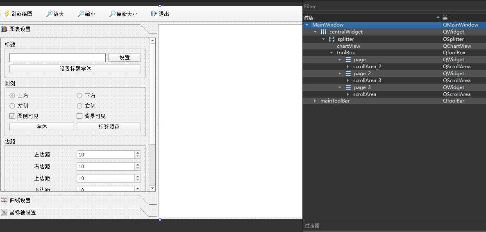

# 目录

- [效果展示](#效果展示-1)
- [功能浅析](#功能浅析-2)
    - [ui设计](#ui设计-1)
    - [demo代码解析](#demo代码解析-2)
        - [1.创建图表](#1-创建图表-1)
        - [2.生成数据](#2-生成数据-2)
        - [3.刷新界面](#3-刷新界面-3)

---
# 效果展示 <a id="效果展示-1"></a>

<video width="800" height="530" controls>
  <source src="base_chart.mp4" type="video/mp4">
</video>

# 功能浅析 <a id="功能浅析-2"></a>

## ui设计 <a id="ui设计-1"></a>



图表的容器由 QGraphicsView 组件提升到 QChartView

## demo代码解析 <a id="demo代码解析-2"></a>

### 1.创建图表 <a id="1-创建图表-1"></a>

```cpp
void MainWindow::createChart()
{
    //创建图表的各个部件
    QChart *chart = new QChart();
    chart->setTitle(tr("简单函数曲线"));
    ui->chartView->setChart(chart);
    ui->chartView->setRenderHint(QPainter::Antialiasing); // 抗锯齿

    // 定义曲线，QChart会将数据中的点链接成取消
    QLineSeries *series0 = new QLineSeries();
    QLineSeries *series1 = new QLineSeries();
    series0->setName("Sin曲线");
    series1->setName("Cos曲线");

    curSeries=series0; //当前序列

    QPen    pen;
    // 虚线
    pen.setStyle(Qt::DotLine);//Qt::SolidLine, Qt::DashLine, Qt::DotLine, Qt::DashDotLine
    pen.setWidth(2);
    pen.setColor(Qt::red);
    series0->setPen(pen); //折线序列的线条设置

    // 实线
    pen.setStyle(Qt::SolidLine);//Qt::SolidLine, Qt::DashLine, Qt::DotLine, Qt::DashDotLine
    pen.setColor(Qt::blue);
    series1->setPen(pen);//折线序列的线条设置

    chart->addSeries(series0);
    chart->addSeries(series1);

    // 定义数轴
    QValueAxis *axisX = new QValueAxis;
    curAxis=axisX; //当前坐标轴
    axisX->setRange(0, 10); //设置坐标轴范围
    axisX->setLabelFormat("%.1f"); //标签格式
    axisX->setTickCount(11); //主分隔个数
    axisX->setMinorTickCount(4); // 两个主分隔之间有4个小格
    axisX->setTitleText("time(secs)"); //标题

    QValueAxis *axisY = new QValueAxis;
    axisY->setRange(-2, 2);
    axisY->setTitleText("value");
    axisY->setTickCount(5);
    axisY->setLabelFormat("%.2f"); //标签格式
    axisY->setMinorTickCount(4);

    //坐标轴添加到图表，并指定方向
    chart->addAxis(axisX,Qt::AlignBottom);
    chart->addAxis(axisY,Qt::AlignLeft);

    series0->attachAxis(axisX); //序列 series0 附加坐标轴
    series0->attachAxis(axisY);

    series1->attachAxis(axisX);//序列 series1 附加坐标轴
    series1->attachAxis(axisY);

    // 上文series0->setName("Sin曲线"); 设置的表标题下方的曲线名称
    foreach (QLegendMarker* marker, chart->legend()->markers()) {
        QObject::disconnect(marker, SIGNAL(clicked()), this, SLOT(on_LegendMarkerClicked()));
        QObject::connect(marker, SIGNAL(clicked()), this, SLOT(on_LegendMarkerClicked()));
    }
}
```

### 2.生成数据 <a id="2-生成数据-2"></a>

```cpp
void MainWindow::prepareData()
{
    //为序列生成数据
    QLineSeries *series0=(QLineSeries *)ui->chartView->chart()->series().at(0);
    QLineSeries *series1=(QLineSeries *)ui->chartView->chart()->series().at(1);

    series0->clear(); //清除数据
    series1->clear();

    qreal   t=0,y1,y2,intv=0.1;
    qreal   rd;
    int cnt=100;
    for(int i=0;i<cnt;i++)
    {
        rd= QRandomGenerator::global()->bounded(-5,6);
        y1=qSin(t)+rd/50;
//        *series0<<QPointF(t,y1);  //序列添加数据点
        series0->append(t,y1);  //序列添加数据点

        rd= QRandomGenerator::global()->bounded(-5,6);

        y2=qCos(t)+rd/50;
//        series1->append(t,y2); //序列添加数据点
        *series1<<QPointF(t,y2); //序列添加数据点

        t+=intv;
    }
}
```

### 3.刷新界面 <a id="3-刷新界面-3"></a>

```cpp
void MainWindow::updateFromChart()
{
    //从图表上获取数据更新界面显示
    QChart  *aChart;
    aChart=ui->chartView->chart();  //获取chart

    ui->editTitle->setText(aChart->title()); //图表标题

    QMargins    mg=aChart->margins(); //边距
    ui->spinMarginLeft->setValue(mg.left());
    ui->spinMarginRight->setValue(mg.right());
    ui->spinMarginTop->setValue(mg.top());
    ui->spinMarginBottom->setValue(mg.bottom());
}
```