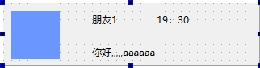

# 目录

- [效果展示](#效果展示-1)
- [功能浅析](#功能浅析-2)
    - [QListWidget](#qlistwidget-1)
        - [基本操作](#基本操作-1)
        - [项目选择](#项目选择-2)
        - [项目编辑](#项目编辑-3)
        - [项目图标和文本](#项目图标和文本-4)
        - [排序和查找](#排序和查找-5)
        - [自定义](#自定义-6)
        - [事件](#事件-7)
    - [QListWidgetItem](#qlistwidgetitem-2)
        - [文本和图标](#文本和图标-8)
        - [数据存储](#数据存储-9)
        - [状态管理](#状态管理-10)
        - [工具提示](#工具提示-11)
        - [大小和尺寸](#大小和尺寸-12)
        - [项类型](#项类型-13)
        - [项的旗帜（Flags）](#项的旗帜-flags-14)
        - [项的检查状态（仅限可勾选的项）](#项的检查状态-仅限可勾选的项-15)
        - [拖放](#拖放-16)

---
# 效果展示 <a id="效果展示-1"></a>
<iframe width="800" height="600" src="list_widget.mp4" frameborder="0" allow="accelerometer; autoplay; encrypted-media; gyroscope; picture-in-picture" allowfullscreen></iframe>

# 功能浅析 <a id="功能浅析-2"></a>

## QListWidget <a id="qlistwidget-1"></a>
### 基本操作 <a id="基本操作-1"></a>
添加项目：使用 addItem()、addItems() 方法添加项目到列表中。  
删除项目：使用 removeItemWidget()、takeItem() 方法删除项目。  
获取项目：使用 item()、itemAt()、itemText() 方法获取项目信息。  
### 项目选择 <a id="项目选择-2"></a>
选择项目：使用 setCurrentItem()、setItemSelected() 方法选择项目。  
获取选中项目：使用 currentItem()、selectedItems() 方法获取选中的项目。  
### 项目编辑 <a id="项目编辑-3"></a>
编辑项目：使用 editItem() 方法进入编辑模式。  
取消编辑：使用 cancelEdit() 方法取消编辑。  
### 项目图标和文本 <a id="项目图标和文本-4"></a>
设置图标：为 QListWidgetItem 设置图标，使用 QListWidgetItem::setIcon()。  
设置文本：为 QListWidgetItem 设置文本，使用 QListWidgetItem::setText()。  
### 排序和查找 <a id="排序和查找-5"></a>
排序：使用 sortItems() 方法对项目进行排序。  
查找：使用 findItems() 方法查找项目。  
### 自定义 <a id="自定义-6"></a>
自定义项：通过继承 QListWidgetItem 并重写 paint() 方法，可以自定义项的绘制。 
使用自定义控件：如demo：通过QListWidget的setItemWidget方法实现自定义窗口显示; 

FiendsItem 类


```cpp

for(int i=0;i<10;i++)
{
    //创建好友列表项
    FiendsItem * friItem = new FiendsItem();
    friItem->setHeadImage("border-radius:30; border-image:url(:/HeadImage/10.png);");
    friItem->setFriendName(QString("朋友%1").arg(i+1));

    //QListWidgetItem
    QListWidgetItem * m_Item = new QListWidgetItem(ui->listWidget);


    //设置管理项，m_Item的宽高
    m_Item->setSizeHint(QSize(281,76));

    //将自定义的Qwidget--friItem,设置为m_Item的小部件。
    ui->listWidget->setItemWidget(m_Item, friItem);
} 

```
### 事件 <a id="事件-7"></a>
项目点击：连接 itemClicked 信号处理项目点击事件。  
项目选择变化：连接 itemSelectionChanged 信号处理项目选择变化事件。  
## QListWidgetItem <a id="qlistwidgetitem-2"></a>
它代表 QListWidget 控件中的一个条目（Item）。QListWidgetItem 可以用来表示文本、图标以及与条目相关联的数据
### 文本和图标 <a id="文本和图标-8"></a>
设置文本：setText(const QString &text) 设置条目的文本。
获取文本：text() const 获取条目的文本。
设置图标：setIcon(const QIcon &icon) 设置条目的图标。
获取图标：icon() const 获取条目的图标。
### 数据存储 <a id="数据存储-9"></a>
设置数据：setData(int role, const QVariant &value) 为条目设置数据，role 指定数据的类型（如显示角色、用户角色等）。
获取数据：data(int role) const 根据 role 获取条目的数据。
### 状态管理 <a id="状态管理-10"></a>
选中状态：setSelected(bool select) 设置条目的选中状态。
检查是否被选中：isSelected() const 检查条目是否被选中。
### 工具提示 <a id="工具提示-11"></a>
设置工具提示：setToolTip(const QString &toolTip) 设置条目的工具提示。
获取工具提示：toolTip() const 获取条目的工具提示。
### 大小和尺寸 <a id="大小和尺寸-12"></a>
设置大小提示：setSizeHint(const QSize &size) 设置条目的大小提示。
获取大小提示：sizeHint() const 获取条目的大小提示。
### 项类型 <a id="项类型-13"></a>
获取类型：type() const 获取条目的类型。
### 项的旗帜（Flags） <a id="项的旗帜-flags-14"></a>
设置旗帜：setFlags(Qt::ItemFlags flags) 设置条目的旗帜，如是否可选择、可编辑等。
获取旗帜：flags() const 获取条目的旗帜。
### 项的检查状态（仅限可勾选的项） <a id="项的检查状态-仅限可勾选的项-15"></a>
设置检查状态：setCheckState(Qt::CheckState state) 设置条目的复选框状态。
获取检查状态：checkState() const 获取条目的复选框状态。
### 拖放 <a id="拖放-16"></a>
设置拖动启用：setDragEnabled(bool enable) 启用或禁用条目的拖动。
设置可放置：setDropEnabled(bool enable) 启用或禁用条目作为拖动目标。