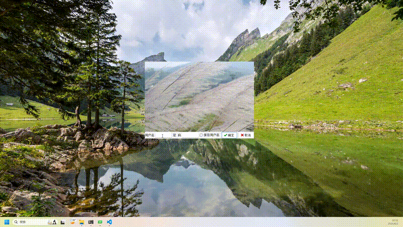
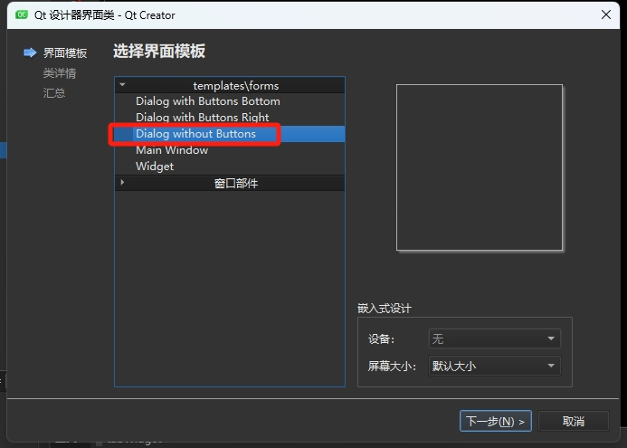

# 效果展示


# 功能浅析
## 窗口创建
窗口创建时选择设计师类、对话框类型


## 重写鼠标事件定位对话框位置
```cpp
void QDlgLogin::mousePressEvent(QMouseEvent *event)
{ 
    //鼠标按键被按下
    if (event->button() == Qt::LeftButton)
    {
        m_moving = true;
        //记录下鼠标相对于窗口的位置
        //event->globalPos()鼠标按下时，鼠标相对于整个屏幕位置
        //pos() this->pos()鼠标按下时，窗口相对于整个屏幕位置
        m_lastPos = event->globalPos() - pos();
    }
    return QDialog::mousePressEvent(event);  //
}

void QDlgLogin::mouseMoveEvent(QMouseEvent *event)
{   
    //鼠标按下左键移动
    //(event->buttons() && Qt::LeftButton)按下是左键
    //鼠标移动事件需要移动窗口，窗口移动到哪里呢？就是要获取鼠标移动中，窗口在整个屏幕的坐标，然后move到这个坐标，怎么获取坐标？
    //通过事件event->globalPos()知道鼠标坐标，鼠标坐标减去鼠标相对于窗口位置，就是窗口在整个屏幕的坐标
    if (m_moving && (event->buttons() && Qt::LeftButton)
        && (event->globalPos()-m_lastPos).manhattanLength() > QApplication::startDragDistance())
    {
        move(event->globalPos()-m_lastPos);
        m_lastPos = event->globalPos() - pos();
    }
    return QDialog::mouseMoveEvent(event);
}
```
## 程序启动前先拉登录框
```cpp
int main(int argc, char *argv[])
{
    QTextCodec *codec = QTextCodec::codecForName("UTF-8");
    QTextCodec::setCodecForLocale(codec); //解决汉字乱码问题

    QApplication a(argc, argv);

    QDlgLogin   *dlgLogin=new QDlgLogin; //创建对话框

    if (dlgLogin->exec()==QDialog::Accepted)
    {
//        delete dlgLogin; 组件已设置关闭后自己释放
        QWMainWindow w;
        w.show();
        return a.exec();
    }
    else
        return  0;
}
```