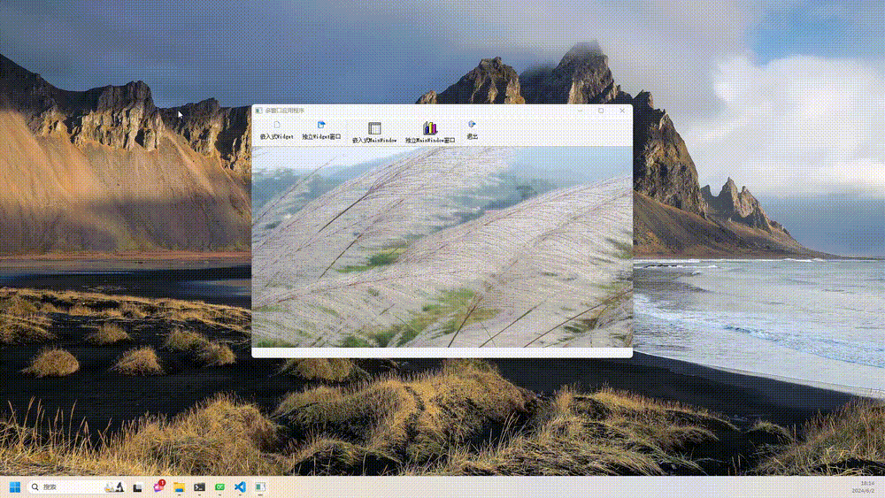

# 目录

- [效果展示](#效果展示-1)
- [功能浅析](#功能浅析-2)
    - [内嵌窗体](#内嵌窗体-1)
    - [脱离程序的窗体](#脱离程序的窗体-2)

---
# 效果展示 <a id="效果展示-1"></a>


# 功能浅析 <a id="功能浅析-2"></a>

## 内嵌窗体 <a id="内嵌窗体-1"></a>
在项目主页的 QTableWidget 中添加自定义的的窗体。

```cpp
//创建QFormDoc窗体，并在tabWidget中显示
QFormDoc *formDoc = new QFormDoc(this); // 指定父窗口
formDoc->setAttribute(Qt::WA_DeleteOnClose); //关闭时自动删除

int cur=ui->tabWidget->addTab(formDoc,
        QString::asprintf("Doc %d",ui->tabWidget->count()));
ui->tabWidget->setCurrentIndex(cur);
ui->tabWidget->setVisible(true);
```
## 脱离程序的窗体 <a id="脱离程序的窗体-2"></a>
```cpp
QFormDoc *formDoc = new QFormDoc(); //不指定父窗口，用show()显示
formDoc->setAttribute(Qt::WA_DeleteOnClose); //关闭时自动删除
formDoc->setWindowTitle("基于QWidget的窗体，无父窗口，关闭时删除");

formDoc->setWindowFlag(Qt::Window,true);
formDoc->setWindowOpacity(0.9);

formDoc->show(); //在单独的窗口中显示
```
