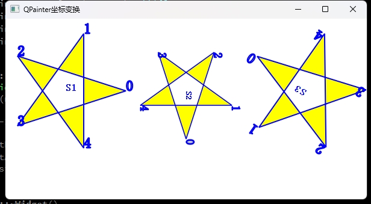

# 目录

- [效果展示](#效果展示-1)
- [功能浅析](#功能浅析-2)
    - [QPainter](#qpainter-1)
        - [主要特性](#主要特性-1)
        - [使用方法](#使用方法-2)
    - [demo中窗体绘制代码](#demo中窗体绘制代码-2)
    - [widget窗口背景绘制](#widget窗口背景绘制-3)

---
# 效果展示 <a id="效果展示-1"></a>



# 功能浅析 <a id="功能浅析-2"></a>

## QPainter <a id="qpainter-1"></a>
`QPainter` 是 Qt 框架中的一个核心类，用于在窗口、图像或打印机上进行2D图形绘制。它提供了丰富的绘图功能，包括线条、形状、文本、图片等的绘制。以下是 `QPainter` 的一些主要特性和使用方法：

### 主要特性 <a id="主要特性-1"></a>

1. **坐标系统**：`QPainter` 允许你设置自己的坐标系统，这意味着你可以自由地定义绘图的起点和方向。

2. **画笔和刷子**：`QPainter` 使用 `QPen` 对象来定义线条的样式，如颜色、宽度和线型；使用 `QBrush` 对象来定义填充区域的颜色和样式。

3. **变换**：`QPainter` 提供了变换功能，可以对绘制的图形进行平移、缩放、旋转和错切等操作。

4. **抗锯齿**：`QPainter` 支持抗锯齿技术，可以使得绘制的线条和形状更加平滑。

5. **透明度**：`QPainter` 支持透明度设置，可以创建半透明的图形效果。

6. **复合模式**：`QPainter` 支持多种绘制复合模式，如源覆盖、源奇偶等，用于控制新绘制内容与现有内容的混合方式。

7. **文本和字体**：`QPainter` 可以绘制文本，并支持多种字体设置。

8. **图像处理**：`QPainter` 支持图像的绘制和处理，可以加载、缩放、旋转和裁剪图像。

### 使用方法 <a id="使用方法-2"></a>
1. **创建 `QPainter` 对象**：首先，你需要创建一个 `QPainter` 对象，通常在 `QWidget` 的 `paintEvent` 方法中进行。

2. **设置画笔和刷子**：使用 `setPen()` 和 `setBrush()` 方法来设置绘制时使用的画笔和刷子。

3. **应用变换**：如果需要，可以使用 `translate()`, `scale()`, `rotate()` 等方法来改变坐标系统。

4. **绘制图形**：使用 `drawLine()`, `drawRect()`, `drawEllipse()`, `drawPolygon()`, `drawText()` 等方法来绘制图形和文本。

5. **结束绘制**：绘制完成后，`QPainter` 对象会自动结束绘制过程，不需要显式调用 `end()` 方法。

## demo中窗体绘制代码 <a id="demo中窗体绘制代码-2"></a>

```cpp
void Widget::paintEvent(QPaintEvent *event)
{
    Q_UNUSED(event);

    QPainter    painter(this);//创建QPainter对象

    painter.setRenderHint(QPainter::Antialiasing);//
    painter.setRenderHint(QPainter::TextAntialiasing);//

    //生成五角星的5个顶点的,假设原点在五角星中心
    qreal   R=100; //半径
    const   qreal Pi=3.14159;
    qreal   deg=Pi*72/180;//

    QPoint points[5]={   //针对Qt 5.12.1 编译错误修改，使用<Qtmath>中的函数 qSin(), qCos()
        QPoint(R,0),
        QPoint(R*qCos(deg),     -R*qSin(deg)),
        QPoint(R*qCos(2*deg),   -R*qSin(2*deg)),
        QPoint(R*qCos(3*deg),   -R*qSin(3*deg)),
        QPoint(R*qCos(4*deg),   -R*qSin(4*deg))
    };

    //设置字体
    QFont   font;
    font.setPointSize(12);
    font.setBold(true);
    painter.setFont(font);

    //设置画笔
    QPen    penLine;
    penLine.setWidth(2); //线宽
    penLine.setColor(Qt::blue); //划线颜色
    //Qt::NoPen,Qt::SolidLine, Qt::DashLine, Qt::DotLine,Qt::DashDotLine,Qt::DashDotDotLine,Qt::CustomDashLine
    penLine.setStyle(Qt::SolidLine);//线的类型，实线、虚线等
    //Qt::FlatCap, Qt::SquareCap,Qt::RoundCap
    penLine.setCapStyle(Qt::FlatCap);//线端点样式
    //Qt::MiterJoin,Qt::BevelJoin,Qt::RoundJoin,Qt::SvgMiterJoin
    penLine.setJoinStyle(Qt::BevelJoin);//线的连接点样式
    painter.setPen(penLine);

    //设置画刷
    QBrush  brush;
    brush.setColor(Qt::yellow); //画刷颜色
    brush.setStyle(Qt::SolidPattern); //画刷填充样式
    painter.setBrush(brush);

    //设计绘制五角星的PainterPath，以便重复使用
    QPainterPath starPath;
    starPath.moveTo(points[0]);
    starPath.lineTo(points[2]);
    starPath.lineTo(points[4]);
    starPath.lineTo(points[1]);
    starPath.lineTo(points[3]);
    starPath.closeSubpath(); //闭合路径，最后一个点与第一个点相连

    starPath.addText(points[0],font,"0"); //显示端点编号
    starPath.addText(points[1],font,"1");
    starPath.addText(points[2],font,"2");
    starPath.addText(points[3],font,"3");
    starPath.addText(points[4],font,"4");

    //绘图
    painter.save(); //保存坐标状态
    painter.translate(100,120);
    painter.drawPath(starPath); //画星星
    painter.drawText(0,0,"S1");
    painter.restore(); //恢复坐标状态

    painter.translate(300,120); //平移
    painter.scale(0.8,0.8); //缩放
    painter.rotate(90); //顺时针旋转
    painter.drawPath(starPath);//画星星
    painter.drawText(0,0,"S2");

    painter.resetTransform(); //复位所有坐标变换
    painter.translate(500,120); //平移
    painter.rotate(-145); //逆时针旋转
    painter.drawPath(starPath);//画星星
    painter.drawText(0,0,"S3");
}
```
## widget窗口背景绘制 <a id="widget窗口背景绘制-3"></a>
```cpp
void paintEvent(QPaintEvent *event) override {
        QPainter painter(this);

        // 设置画笔颜色
        painter.setPen(Qt::black);

        // 设置背景刷子样式和颜色
        QBrush brush(Qt::SolidPattern);
        brush.setColor(QColor("lightblue"));
        painter.setBrush(brush);

        // 绘制背景
        painter.drawRect(rect());

    }
```