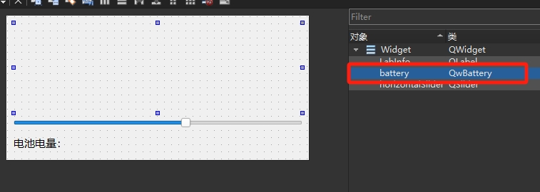

# 目录

- [效果展示](#效果展示-1)
- [功能浅析](#功能浅析-2)
    - [主程序UI](#主程序ui-1)
    - [在 Designer 里放自定义插件](#在-designer-里放自定义插件-2)

---
# 效果展示 

<iframe width="400" height="300" src="plug_in.mp4" frameborder="0" allow="accelerometer; autoplay; encrypted-media; gyroscope; picture-in-picture" allowfullscreen></iframe>

# 功能浅析 

## 主程序UI 

界面插件继承 QWidget，再主界面上防止一个 widget窗口占位，然后右键组件升级。

## 在 Designer 里放自定义插件 

需要使用当前的 QT Creator 编译时的编译器，然后将编译的库放到qt的该编译器的 designer 目录下
