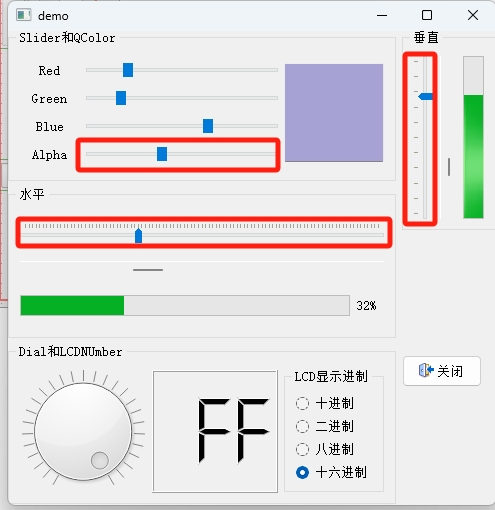
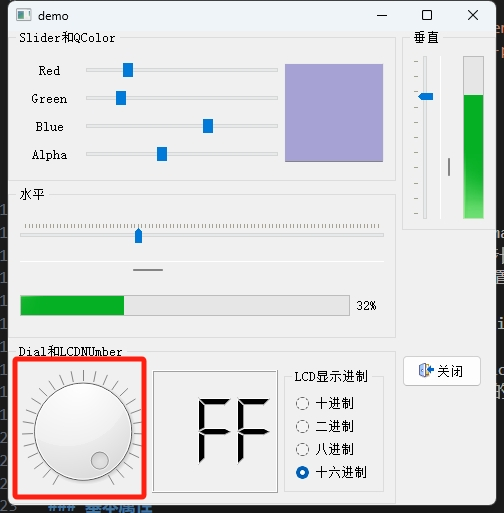

# 目录

- [效果展示](#效果展示-1)
- [功能浅析](#功能浅析-2)
    - [QSlider](#qslider-1)
        - [基本属性](#基本属性-1)
        - [事件](#事件-2)
        - [自定义](#自定义-3)
    - [QDial](#qdial-2)
        - [基本属性](#基本属性-4)
        - [事件](#事件-5)
        - [自定义](#自定义-6)
    - [QProgressBar](#qprogressbar-3)
        - [基本属性](#基本属性-7)
        - [模式](#模式-8)
        - [自定义](#自定义-9)

---
# 效果展示 

<iframe width="490" height="506" src="progress_demo.mp4" frameborder="0" allow="accelerometer; autoplay; encrypted-media; gyroscope; picture-in-picture" allowfullscreen></iframe>

# 功能浅析 
## QSlider 

### 基本属性 
方向：QSlider 可以设置为水平或垂直方向。  
范围：通过 setMinimum(int min) 和 setMaximum(int max) 方法设置滑动条的最小值和最大值。  
步长：通过 setTickInterval(int tick) 设置滑动条的步长，即滑块移动时数值变化的间隔。  
滑块位置：通过 setValue(int value) 设置滑块的当前位置  
### 事件 
值改变事件：当滑块的位置改变时，会发出 valueChanged(int value) 信号。
### 自定义 
刻度：可以通过 setTickPosition(QSlider::TickPosition position) 设置刻度的位置。  
外观：可以通过样式表（StyleSheet）来自定义 QSlider 的外观。  

## QDial 

### 基本属性 
范围：通过 setMinimum(int min) 和 setMaximum(int max) 方法设置旋钮的最小值和最大值。  
值：通过 setValue(int value) 设置旋钮的当前值。  
步长：通过 setSingleStep(int step) 设置单步值，即每次旋转时数值变化的量。  
角度范围：QDial 默认可以旋转360度，但可以通过 setMinimumAngle(int angle) 和 setMaximumAngle(int angle) 来限制旋转的角度范围  
### 事件 
值改变事件：当旋钮的值改变时，会发出 valueChanged(int value) 信号。
### 自定义 
外观：可以通过样式表（StyleSheet）来自定义 QDial 的外观，包括指针的颜色、形状和背景的样式。  
行为：可以通过 setNotchesVisible(bool visible) 来设置是否显示刻度。  
范围选择：虽然 QDial 主要用于选择单个值，但也可以配置为范围选择模式，允许用户选择一个值的范围。  
自定义行为：可以通过重写 QDial 的事件处理函数来实现更复杂的用户交互行为。  
## QProgressBar 

### 基本属性 
最小值和最大值：通过 setMinimum(int min) 和 setMaximum(int max) 方法设置进度条的最小值和最大值。默认情况下，最小值是0，最大值是100。  
当前值：通过 setValue(int value) 设置进度条的当前值。  
### 模式 
确定性模式：进度条有一个确定的最大值，随着任务的进展，进度条逐渐填满。  
不确定性模式：进度条不确定，通常用于表示某个任务正在进行，但完成时间未知。在这种模式下，进度条会显示一个动画，表示活动正在进行。  
### 自定义 
文本显示：可以通过 setMinimum 和 setMaximum 之外，还可以通过 setTextVisible(bool visible) 来设置是否显示进度文本。  
外观：可以通过样式表（StyleSheet）来自定义 QProgressBar 的外观，包括进度条的颜色、高度等。  