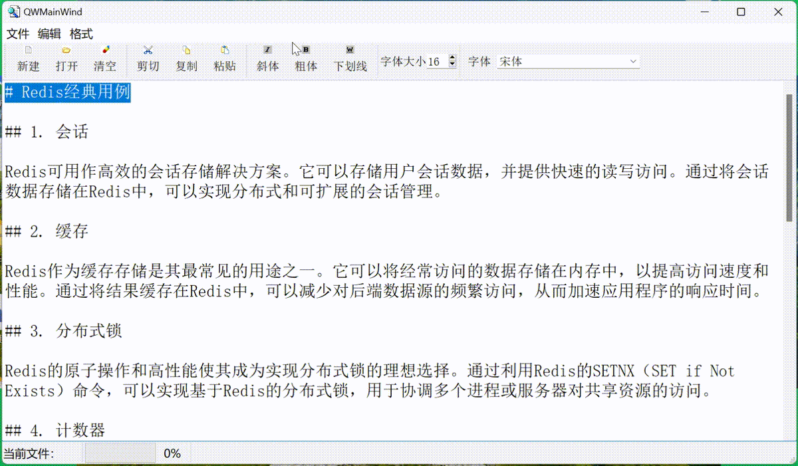
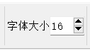

# 目录

- [效果展示](#效果展示-1)
- [功能浅析](#功能浅析-2)
    - [工具栏 QToolBar](#工具栏-qtoolbar-1)
    - [菜单栏 QMenuBar](#菜单栏-qmenubar-2)
    - [状态栏 QStatusBar](#状态栏-qstatusbar-3)
    - [字体大小组件 QSpinBox](#字体大小组件-qspinbox-4)
    - [字体选择组件 QFontComboBox](#字体选择组件-qfontcombobox-5)

---
# 效果展示 <a id="效果展示-1"></a>


# 功能浅析 <a id="功能浅析-2"></a>
## 工具栏 QToolBar <a id="工具栏-qtoolbar-1"></a>


QToolBar 提供了一个工具栏，用于包含各种命令按钮或工具按钮（QAction 或 QToolButton）  
这些按钮通常用于执行常用的操作，如保存、打开、复制、粘贴等。  
工具栏中的按钮可以很容易地通过拖放进行自定义和重新排列。  
它们经常出现在主窗口的顶部或侧面，作为用户界面的一部分。  
## 菜单栏 QMenuBar <a id="菜单栏-qmenubar-2"></a>


QMenuBar 提供了一个菜单栏，它包含一系列的菜单项（QMenu）。  
每个菜单项可以包含子菜单项和/或动作（QAction）。  
菜单栏通常出现在主窗口的顶部，用于组织和管理应用程序的不同功能和选项。  
用户可以通过选择菜单栏中的项来访问不同的功能或设置。  
## 状态栏 QStatusBar <a id="状态栏-qstatusbar-3"></a>


QStatusBar 提供了一个状态栏，用于在主窗口的底部显示信息。  
它经常用于显示应用程序的状态信息、进度指示器、临时消息等。  
状态栏中的信息可以是文本、图标或自定义部件。  
它为应用程序提供了一种向用户传达状态或提供反馈的便捷方式。
## 字体大小组件 QSpinBox <a id="字体大小组件-qspinbox-4"></a>


```cpp
spinFontSize = new QSpinBox;// 工具栏上的文字大小 SpinBox
spinFontSize->setMinimum(5);
spinFontSize->setMaximum(50);
spinFontSize->setValue(ui->txtEdit->font().pointSize());//初始值
spinFontSize->setMinimumWidth(50);//设置组件最小宽度

ui->mainToolBar->addWidget(new QLabel(QString::fromUtf8("字体大小"))); //不引用的Label无需定义变量
ui->mainToolBar->addWidget(spinFontSize); //SpinBox添加到工具栏
void QWMainWind::on_spinBoxFontSize_valueChanged(int aFontSize)
{
    //改变字体大小的SpinBox的响应
    QTextCharFormat fmt;
    fmt.setFontPointSize(aFontSize); //设置字体大小
    ui->txtEdit->mergeCurrentCharFormat(fmt);
}
```

## 字体选择组件 QFontComboBox <a id="字体选择组件-qfontcombobox-5"></a>
 

```cpp
ui->mainToolBar->addSeparator(); //工具栏上增加分隔条
ui->mainToolBar->addWidget(new QLabel(" 字体 "));
comboFont = new QFontComboBox;//字体名称ComboBox
comboFont->setMinimumWidth(150); //设置组件最小宽度
ui->mainToolBar->addWidget(comboFont);//添加到工具栏

void QWMainWind::on_comboFont_currentIndexChanged(const QString &arg1)
{
    //FontCombobox的响应，选择字体名称
    QTextCharFormat fmt;
    fmt.setFontFamily(arg1);//设置字体名称
    ui->txtEdit->mergeCurrentCharFormat(fmt);
}
```

