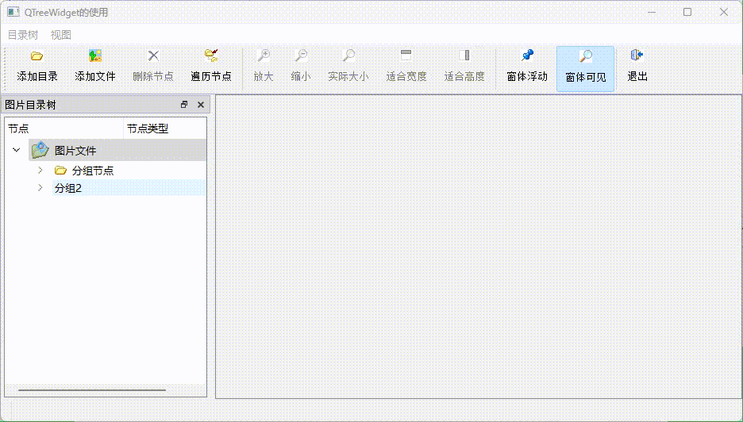

# 目录

- [效果展示](#效果展示-1)
- [功能浅析](#功能浅析-2)
    - [QTreeWidget](#qtreewidget-1)
        - [基本结构](#基本结构-1)
        - [列和内容](#列和内容-2)
        - [选择和管理](#选择和管理-3)
        - [拖放](#拖放-4)
        - [自定义绘制](#自定义绘制-5)
        - [排序和搜索](#排序和搜索-6)
        - [示例中增删节点操作](#示例中增删节点操作-7)
    - [QTreeWidgetItem](#qtreewidgetitem-2)
        - [基本属性](#基本属性-8)
        - [数据存储](#数据存储-9)
        - [子项管理](#子项管理-10)
        - [树结构导航](#树结构导航-11)
        - [状态管理](#状态管理-12)
        - [项的旗帜（Flags）](#项的旗帜-flags-13)
        - [拖放操作](#拖放操作-14)
        - [自定义绘制](#自定义绘制-15)
        - [排序和搜索](#排序和搜索-16)
    - [QDockWidget](#qdockwidget-3)
        - [1. 创建和添加 `QDockWidget`](#1-创建和添加-qdockwidget-17)
        - [2. 停靠和浮动](#2-停靠和浮动-18)
        - [3. 自定义标题栏](#3-自定义标题栏-19)
        - [4. 特性](#4-特性-20)
        - [5. 使用示例](#5-使用示例-21)
- [include <QApplication>](#include-qapplication-3)
- [include <QMainWindow>](#include-qmainwindow-4)
- [include <QDockWidget>](#include-qdockwidget-5)
- [include <QTextEdit>](#include-qtextedit-6)

---
# 效果展示 <a id="效果展示-1"></a>



# 功能浅析 <a id="功能浅析-2"></a>

## QTreeWidget <a id="qtreewidget-1"></a>
### 基本结构 <a id="基本结构-1"></a>
项（Items）：树中的每个节点称为一个项，可以通过 QTreeWidgetItem 类来创建和管理。  
子项（Child Items）：每个项可以有零个或多个子项，形成层次结构。  
### 列和内容 <a id="列和内容-2"></a>
添加列：使用 addColumn() 方法为树添加列。  
设置内容：为每个项的每个列设置文本或图标，使用 QTreeWidgetItem::setText() 和 QTreeWidgetItem::setIcon()。  
### 选择和管理 <a id="选择和管理-3"></a>
选择项：用户可以通过点击来选择项，也可以通过代码使用 QTreeWidget::setCurrentItem() 来设置当前选中项。  
多选：QTreeWidget 支持多项选择，可以通过设置 setSelectionMode(QAbstractItemView::MultiSelection) 来启用。  
### 拖放 <a id="拖放-4"></a>
拖放支持：QTreeWidget 支持拖放操作，可以通过 QTreeWidgetItem::setDragEnabled() 和 QTreeWidget::setDropIndicatorShown() 来启用。  
### 自定义绘制 <a id="自定义绘制-5"></a>
自定义项绘制：可以为 QTreeWidgetItem 重写 paint() 方法来自定义项的绘制。  
自定义项大小：可以为每个项或每列设置不同的大小，使用 QTreeWidgetItem::setSizeHint() 和 resizeColumnToContents()。  
自定义Item：
```cpp
QTreeWidget treeWidget;
treeWidget.setWindowTitle("Tree Widget with Custom Item Widget Example");

// 添加列
QStringList headerLabels;
headerLabels << "Name" << "Actions";
treeWidget.setHeaderLabels(headerLabels);

// 创建项
QTreeWidgetItem *item = new QTreeWidgetItem(treeWidget, QStringList() << "Alice" << "30");

// 创建自定义控件，例如一个按钮
QPushButton *button = new QPushButton("Click me");

// 创建布局并添加按钮
QVBoxLayout *layout = new QVBoxLayout;
layout->addWidget(button);

// 将自定义控件设置到树状控件的第二列
treeWidget.setItemWidget(item, 1, layout);
```
### 排序和搜索 <a id="排序和搜索-6"></a>
排序：可以启用自动排序，使用 QTreeWidget::setSortingEnabled()。  
搜索：可以实现键盘搜索功能，通过处理 QTreeWidget 的 keyPressEvent  

### 示例中增删节点操作 <a id="示例中增删节点操作-7"></a>

```cpp
void MainWindow::addFolderItem(QTreeWidgetItem *parItem, QString dirName)
{
    //添加一个目录节点
    QIcon   icon(":/images/icons/open3.bmp");
    QString NodeText=getFinalFolderName(dirName); //从一个完整目录名称里，获得最后的文件夹名称

    QTreeWidgetItem *item; //节点
    item=new QTreeWidgetItem(MainWindow::itGroupItem); //新建节点, 设定type为 itGroupItem
    item->setIcon(colItem,icon); //设置图标
    item->setText(colItem,NodeText); //最后的文件夹名称，第1列
    item->setText(colItemType,"type=itGroupItem"); //完整目录名称，第2列
    item->setFlags(Qt::ItemIsSelectable | Qt::ItemIsUserCheckable | Qt::ItemIsEnabled | Qt::ItemIsAutoTristate); //设置节点选项
    item->setCheckState(colItem,Qt::Checked); //节点选中
    item->setData(colItem,Qt::UserRole,QVariant(dirName)); //设置角色为Qt::UserRole的Data,存储完整目录名称

    parItem->addChild(item); //在父节点下面添加子节点
}

void MainWindow::on_actDeleteItem_triggered()
{   
    //删除节点
    QTreeWidgetItem* item =ui->treeFiles->currentItem(); //当前节点
    QTreeWidgetItem* parItem=item->parent(); //父节点
    parItem->removeChild(item);//The removed item will not be deleted
    delete item;
}

void MainWindow::changeItemCaption(QTreeWidgetItem *item)
{
    //改变节点的标题文字
    QString str="*"+item->text(colItem);  //节点标题前加“*”
    item->setText(colItem,str); //设置节点标题

    if (item->childCount()>0) //如果有子节点
    for (int i=0;i<item->childCount();i++) //遍历子节点
       changeItemCaption(item->child(i));  //调用自己，可重入的函数
}

```
## QTreeWidgetItem <a id="qtreewidgetitem-2"></a>
它代表 QTreeWidget 控件中的一个树形结构的项（Item）。每个 QTreeWidgetItem 可以包含文本、图标、子项，并且可以拥有不同的状态和属性。  
### 基本属性 <a id="基本属性-8"></a>
文本和图标：可以为每个项设置文本和图标，分别使用 setText(int column, const QString &text) 和 setIcon(int column, const QIcon &icon) 方法。
### 数据存储 <a id="数据存储-9"></a>
设置数据：使用 setData(int column, int role, const QVariant &value) 为特定列和角色设置数据。  
获取数据：使用 data(int column, int role) 根据列和角色获取数据。  
### 子项管理 <a id="子项管理-10"></a>
添加子项：使用 addChild(QTreeWidgetItem *child) 方法添加子项。  
获取子项：使用 child(int index) 和 child(int column, int role) 方法获取子项。  
### 树结构导航 <a id="树结构导航-11"></a>
获取父项：使用 parent() 方法获取父项。  
获取树：使用 treeWidget() 方法获取所属的 QTreeWidget。  
### 状态管理 <a id="状态管理-12"></a>
选中状态：使用 setSelected(bool select) 设置选中状态，使用 isSelected() 检查是否被选中。  
可编辑状态：使用 setEditable(bool editable) 设置是否可编辑。  
### 项的旗帜（Flags） <a id="项的旗帜-flags-13"></a>
设置旗帜：使用 setFlags(Qt::ItemFlags flags) 设置项的旗帜，如是否可选择、可编辑等。  
获取旗帜：使用 flags() 获取项的旗帜。  
### 拖放操作 <a id="拖放操作-14"></a>
启用拖放：使用 setDragEnabled(bool enable) 启用拖动，使用 setDropEnabled(bool enable) 启用放置。  
### 自定义绘制 <a id="自定义绘制-15"></a>
自定义绘制：通过重写 QTreeWidgetItem 的 paint() 方法，可以自定义项的绘制。  
### 排序和搜索 <a id="排序和搜索-16"></a>
排序：QTreeWidgetItem 可以被自动排序，如果 QTreeWidget 的排序被启用。  
搜索：可以实现键盘搜索功能，通过处理 QTreeWidget 的 keyPressEvent。 

## QDockWidget <a id="qdockwidget-3"></a>
`QDockWidget` 是 Qt 框架中的一个控件，它允许你创建可停靠的窗口，这些窗口可以附着（停靠）在主窗口的边缘，或者浮动在主窗口之外。`QDockWidget` 通常用于提供辅助工具栏、控制面板或其他需要用户根据需要显示或隐藏的界面元素。

以下是 `QDockWidget` 的一些关键特性和使用方法：

### 1. 创建和添加 `QDockWidget` <a id="1-创建和添加-qdockwidget-17"></a>
你可以创建一个 `QDockWidget`，并通过 `setWidget` 方法添加一个内部的 `QWidget` 来定义其内容。

```cpp
QDockWidget *dock = new QDockWidget("Dock Title", parent);
QWidget *container = new QWidget();
dock->setWidget(container);
```

### 2. 停靠和浮动 <a id="2-停靠和浮动-18"></a>
`QDockWidget` 可以停靠在主窗口的左侧、右侧、顶部或底部，也可以设置为浮动。

```cpp
// 设置停靠位置
dock->setFloating(true); // 浮动
dock->setFloating(false); // 停靠

// 停靠到主窗口的特定边缘
QMainWindow *mainWindow = qobject_cast<QMainWindow *>(parent);
mainWindow->addDockWidget(Qt::LeftDockWidgetArea, dock);
```

### 3. 自定义标题栏 <a id="3-自定义标题栏-19"></a>
`QDockWidget` 有一个可自定义的标题栏，可以显示窗口的标题，并且可以拖动。

### 4. 特性 <a id="4-特性-20"></a>
- **可停靠性**：可以设置 `QDockWidget` 是否可以被停靠或浮动。
- **可闭性**：可以设置 `QDockWidget` 是否可以被用户关闭。
- **唯一性**：每个 `QMainWindow` 可以有多个 `QDockWidget`，但每个标题只能有一个对应的 `QDockWidget`。

### 5. 使用示例 <a id="5-使用示例-21"></a>
```cpp
# include <QApplication> <a id="include-qapplication-3"></a>
# include <QMainWindow> <a id="include-qmainwindow-4"></a>
# include <QDockWidget> <a id="include-qdockwidget-5"></a>
# include <QTextEdit> <a id="include-qtextedit-6"></a>

int main(int argc, char *argv[]) {
    QApplication app(argc, argv);

    QMainWindow mainWindow;
    mainWindow.setWindowTitle("QDockWidget Example");

    QDockWidget *dock = new QDockWidget("TextEdit", &mainWindow);
    QTextEdit *textEdit = new QTextEdit();
    dock->setWidget(textEdit);

    mainWindow.addDockWidget(Qt::RightDockWidgetArea, dock);

    mainWindow.show();
    return app.exec();
}
```
在这个示例中，我们创建了一个带有 `QTextEdit` 的 `QDockWidget`，并将其停靠在主窗口的右侧。

`QDockWidget` 是一个非常有用的控件，可以增强应用程序的灵活性和用户体验。通过使用 `QDockWidget`，用户可以根据个人的工作流程和偏好来自定义界面布局。
